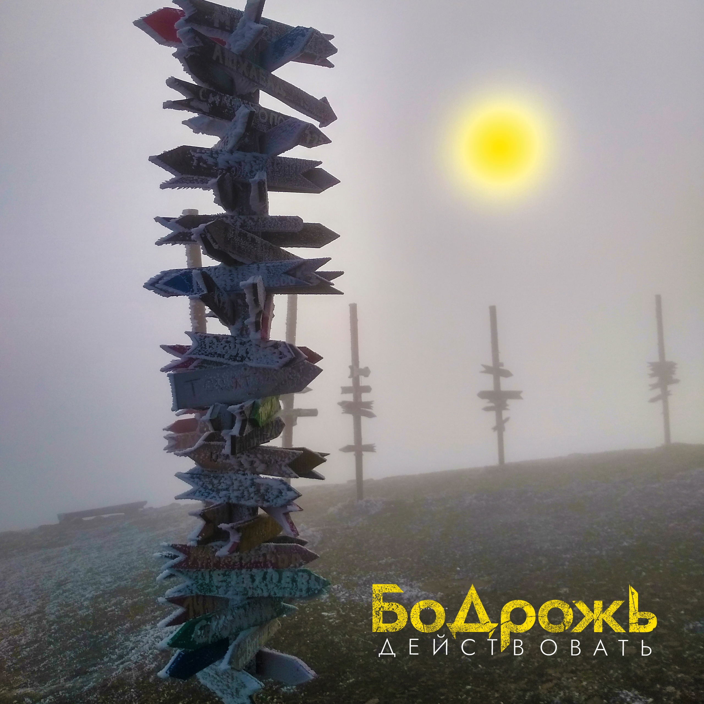

## Бодрожь - Действовать <small>(текст песни)</small>

Чего-то не хватает нам, чтобы начать действовать.  
Сегодня бегать не иду - ну нет новых кроссовок.  
Да и вообще погода так себе, чтобы усердствовать.  
История без новых зарисовок.

На новый уровень - зачем? И знаний маловато.  
Не время, мне пройти еще хотя бы пару тренингов.  
К тому же изменения проходят черевато.  
В сомнениях, их множество примерено.  

Работу поменять - да нет, там риск космический.  
Пусть и не нравится сейчас, но платят более-менее.  
У всех у нас, к тому же, обязательства в наличии.  
А свою личность отпускаем по течению.  

Библиотеки? - Прошлый век, все знания в интернете.  
Я там любую информацию найду в два счёта.  
Поисковик, конечно, на любой вопрос ответит.  
Много нашёл? (Кроме видосов мимолётных.)

`***`

*Припев:*

Война, агония, внутри тебя, меня.  
Но я найду баланс, в нас оживёт гармония.  
За рамки, за края, отбрось сомнения.  
Время не будет ждать. Напишем новую историю.  

`***`

Мы так устроены, что ждём чего-то постоянно.  
Нового понедельника, момента подходящего.  
Мечты остались где-то в детстве, глубоко мы явно  
их прячем в ящике, плюс перемены настоящие.  

А экономя на одном, впустую тратим время.  
Которое, увы, несётся безвозвратно.  
Реально важное важно не спутать с белой сажей,  
Что разлетается по ветру враз, внезапно.  

Себя, тебя прошу - не останавливайся.  
Часто паузы отбрасывают нас назад.  
Жизнь убегает, успеваешь в ритме вальса?  
Конечно проще сказать, что кто-то виноват.  

Я постараюсь не упускать моменты и возможности,  
Несмотря на шум, заметить значимое.  
И двигаться вперед, переступая сложности,  
Что укрепляют, прибавляют силы, однозначно.  

`***`

*Припев:*

Война, агония, внутри тебя, меня.  
Но я найду баланс, в нас оживёт гармония.  
За рамки, за края, отбрось сомнения.  
Время не будет ждать. Напишем новую историю.

`***`

Я не о том, как плохо всё, наоборот скорее.  
На самом деле можем многое, знаний достаточно.  
Что не хватает - подберём в дороге, став мудрее.  
Больше усилий и удаляю лень остаточную.  

Сегодня, здесь, сейчас. Всё можно и доступно.  
На жизнь время найду, для грусти нет причины.  
Цели достигну и не заберёт рутины ступор.  
Так ты со мной? Подход серьёзный, молодчина!

Меняю город, в неизвестность. Перемены - к лучшему.  
А не понравится - в другой, всегда можно вернуться.  
Там впереди картины новые, лучше минувших.  
Но ждать не будут, нужно вовремя проснуться.

Возможности приходят, разглядеть пытайся,  
С малых шагов может начаться большой путь.  
Идти к мечте, пусть потихоньку, но стараясь.  
В первую очередь с собою честен будь.

`***`

*Припев: (2 раза)*

Война, агония, внутри тебя, меня.  
Но я найду баланс, в нас оживёт гармония.  
За рамки, за края, отбрось сомнения.  
Время не будет ждать. Напишем новую историю.

`***`

Отмазки для себя придумываем зачастую,  
Но время ограничено, напрасно глупо тратить.  
Представь, что ты достиг конца своей тетради.  
Вся ли исписана или полупустую? (на полку)

Тебе знакомо? Нет? Отлично, а иначе всё же  
Я предлагаю над собой работать перманентно.  
Плюс/минус мы с тобой похожи, я такой же, тоже.  
Не без изъянов, но из ямы непременно. (есть выход)

Я не хочу жалеть о том, чего не сделал, после.  
Тем более, добравшись до точки невозврата.  
Сетовать на судьбу, мол выдала плохие карты  
Не буду. Не в них ведь дело, вовсе.