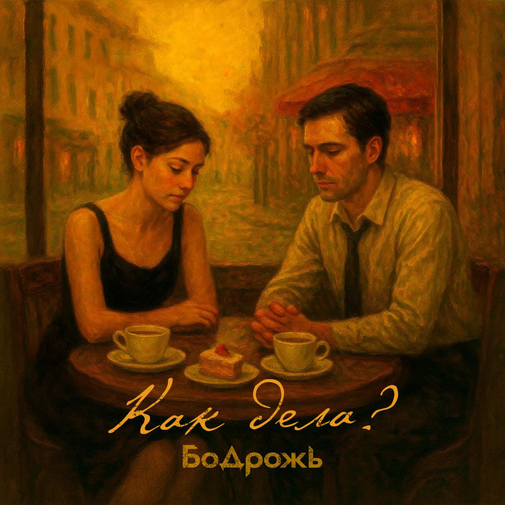

## Бодрожь - Как дела? <small>(текст песни)</small>

*Припев: (2 раза)*

Как там у тебя дела?  
Все хорошо или как сажа бела?  
Дуют ветра, все как задумано?   
Новый успех, новый этап или  
Уже не так крутится тот мир,  
Что окружал нас?

`***`

Минуя поэтичность,  
Мы перешли на личность.  
Музыка медленно  
Играла мелодично.  

Смотрит эпично.  
-Ну как там у тебя на личном?  
-Да всё отлично, а у вас?  
-Аналогично.

-Как жизнь? Ритмична?  
А эпизоды динамичны?  
Ну как у всех -  
Спокойна и статична.  

Ясно. Типично.  
Перевели тему тактично.  
Повспоминали  
Что нас связывало лично.  

Взгляды на вещи прозаичны.  
Порой настрой меланхоличный.  
Но мы прогоним его,  
Чиркнув спичкой.  

Всё так же симпатична  
И грациозна, эстетична,  
Но скажу ей -  
Будет лишней риторичность.  

`***`

*Припев: (2 раза)*

Как там у тебя дела?  
Все хорошо или как сажа бела?  
Дуют ветра, все как задумано?   
Новый успех, новый этап или  
Уже не так крутится тот мир,  
Что окружал нас?

`***`

Да, Время было безгранично...  
Теперь заботы и привычность.  
Куда-то делась  
Та былая энергичность.  

К чему нам драматичность?  
Мы к переменам эластично.  
А говорят,  
Что во вселенной всё циклично.  

Вообще логично  
Что позади вся неприличность.  
Радость с осадком  
Вытекали органично.  

Всё же частично  
Мы не забудем те странички.  
Пусть мало общего теперь,  
Много различий.

`***`

Дипломатично  
Пора прощаться и этично  
Официант спросил оплату.  
-Безналично.  

Десерт черничный.  
Минуты словно электричка.  
Не забывай, храни надежно,  
Герметично.  

`***`

*Припев: (2 раза)*

Как там у тебя дела?  
Все хорошо или как сажа бела?  
Дуют ветра, все как задумано?   
Новый успех, новый этап или  
Уже не так крутится тот мир,  
Что окружал нас?

`***`

