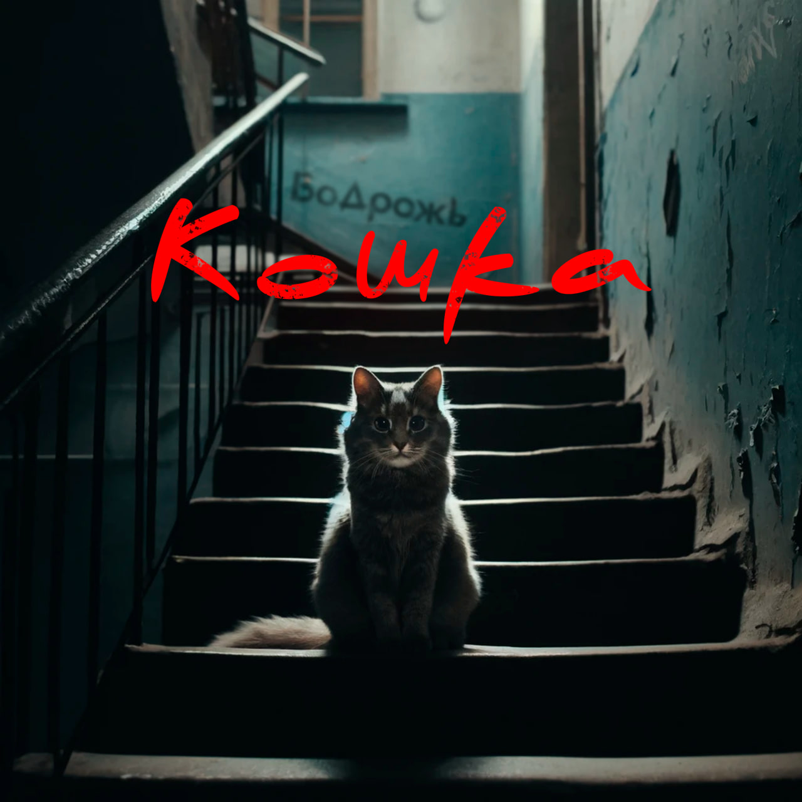

## Бодрожь - Кошка <small>(текст песни)</small>

Под дверью кошка (тихо)  
Молча сидела.  
Тепла немножко (ей бы)  
Она хотела.

Чуточку ласки, (каплю)  
Любви кусочек.  
Милые глазки, (сказка)  
Серый комочек.

Чтобы свой угол, (туда)  
Там, где не гонят.  
Чтоб без испуга (всегда)  
В чьи-то ладони.

В чьи-то объятия.  
Просто мурлыкать.  
Просто принять её  
К себе без крика.

Немного ласки...  
Немного ласки...

`***`

*Припев:*

Ей бы  
Немного ласки,  
Милые глазки,  
Любви кусочек.

Чтобы свой угол,  
Там, где не гонят.  
Чтоб без испуга  
В чьи-то ладони.

`***`

Немного...  
Немного ласки...

Несколько раз (она)  
Она приходила.  
И напоказ (уу)  
Еды не просила.

Если кто гладил, (мурлыча)  
С радостью пела.  
Терлась о ноги, (мечту)  
Надежду грела.

После пропала, (куда?)  
Никто не видел.  
Дом отыскала? (или...)  
Кто-то обидел?

Немного ласки  
Свой уголочек,  
Найдёт пусть каждый такой  
Ангелочек.

`***`

Ей бы  
Немного ласки,  
Милые глазки,  
Любви кусочек.

`***`

*Припев:*

Немного ласки,  
Любви кусочек.  
Милые глазки,  
Серый комочек.

Чтобы свой угол,  
Там, где не гонят.  
Чтоб без испуга  
В чьи-то ладони.

`***`

Немного...  
Немного ласки...