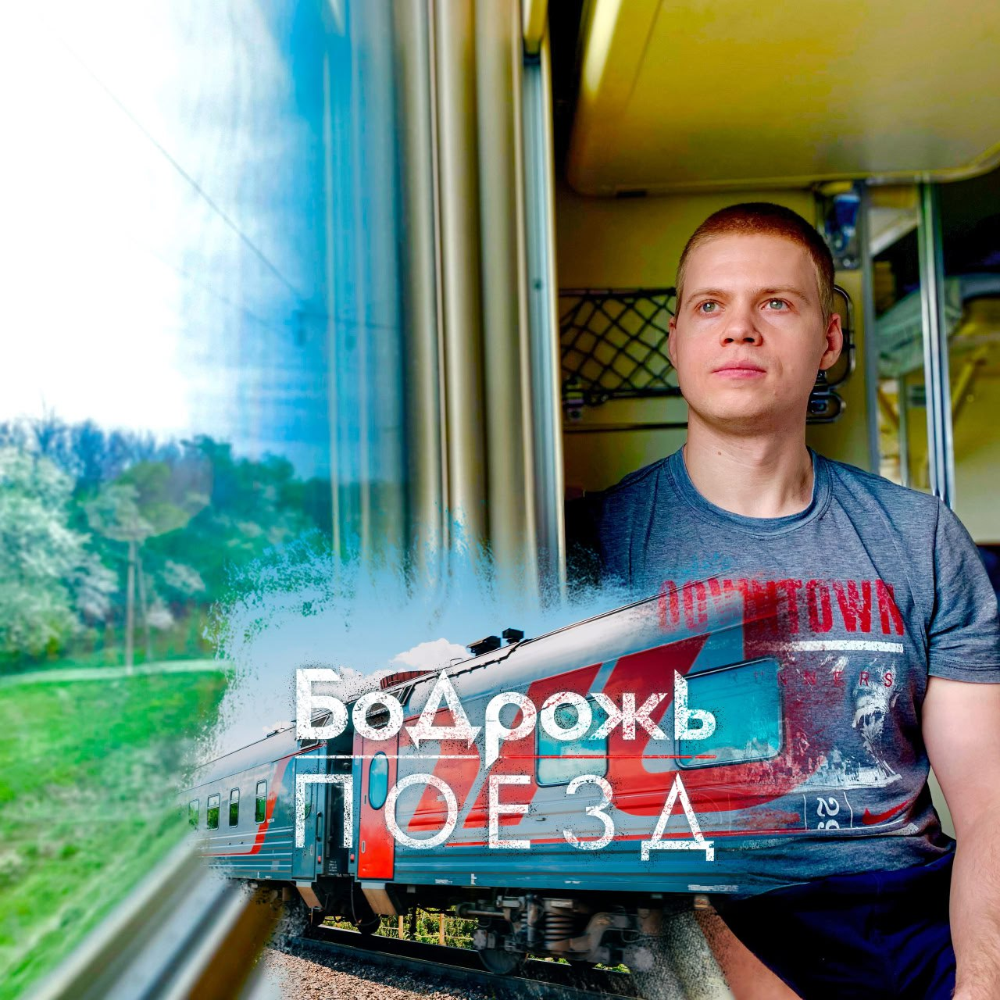

## Бодрожь - Поезд <small>(текст песни)</small>

К точкам, обозначенным на карте,  
Двигался поезд (Двигался поезд)  
И проезжал он очередной уезд.

В плацкарте не было свободных мест.  
В плацкарте не было свободных мест.  
В плацкарте не было свободных мест.  
Не было мест.

Он мчался вдаль, назад не отступая.  
Со стороны одной,  
Где-то на боковой  
Солнце лучами осыпало играя  
Между березами, осиной и сосной.

Здесь как и раньше на столах съестное.  
Овощи, водичка,  
Лапша БП, яички.  
Лишь в тамбуре сейчас дело иное:  
Вряд-ли найдётся место спичкам.

`***`

*Припев:*

Наш новый путь,  
Добрым будет пусть.  
Печаль обойдет  
И покинет грусть.

Я вернусь,  
Снова я вернусь.  
Оглянусь, останусь  
И улыбнусь.

`***`

Кроссворды, телефоны  
За чашкой чая.  
И времени не замечаешь.  
За окошком фоны  
Не оставляют повод для печали.  
Отчаянье отчалит от причала.

Нас провожают деревья, смотрят вслед.  
С красивыми местами и полевыми цветами,  
Которые так любишь, удаляясь в силуэт.  
Неся вперёд состав, наполненный мечтами.

В плацкарте не было свободных мест.  
В плацкарте не было свободных мест.  
В плацкарте не было свободных мест.  
Не было мест.

С попутчиком обсудим, кто откуда,  
Куда свой путь направил,  
Что позади оставил.  
И как его - спокойно или люто  
Жизнь повела закономерно и без правил.

Так к точкам, обозначенным на карте,  
Двигался поезд.  
И проезжал он очередной уезд.

`***`

*Припев:*

Наш новый путь,  
Добрым будет пусть.  
Печаль обойдет  
И покинет грусть.

Я вернусь,  
Снова я вернусь.  
Оглянусь, останусь  
И улыбнусь.

`***`

В окнах мелькают города и села.  
Запомню путь таким,  
Ведь мною он любим.  
Леса, поля и реки да озера.  
Местами несуразен, в основном, неотразим.

Мы подъезжаем к станции конечной.  
С собой возьму  
Букет противоречий.  
Кину рюкзак на плечи,  
И в окончанье данному письму  
Прощаюсь, говорю: "До новой встречи".