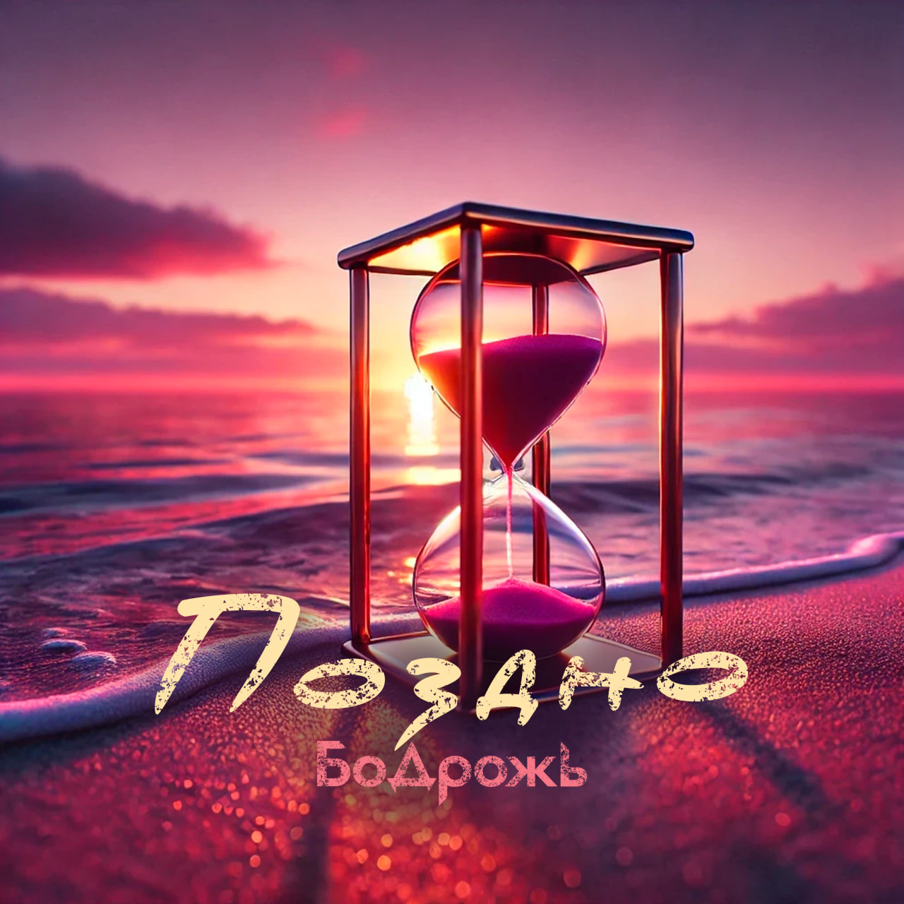

## Бодрожь - Поздно <small>(текст песни)</small>

Поздно поняв терпкую, едкую суть,  
Судьбу порой уже не в силах изменить.  
Пройдя определённый жизни путь,  
Годы назад, увы, не возвратить.

`***`

*Припев:*

Тот риск однажды можно в счастье обернуть,  
Если доверие сердцу, удачи сохранить.  
Или напротив, в муках после себя упрекнуть  
И сожалеть о той возможности иначе поступить.

Но если посчастливится тебе рискнуть,  
Причины, отголоски сможешь укротить,  
Желаемому сложно будет ускользнуть,  
Стрелку часов получится на миг остановить.

`***`

По теченью плыть и опасаться  
Пусть не станет частью нашего портрета.  
На пути не страшно ошибаться,  
Хуже вспоминать упущенные эстафеты.

Я не буду в крайности бросаться.  
Между чёрным, белым пробираюсь где-то.  
Постараюсь настоящим оставаться,  
И я искренне верю в наши победы.

Побеждать мы будем свои страхи,  
Неуверенности не оставим следа.  
Скверность, скованность идут прямиком на плаху.  
Не получится у нас с ними дуэта.

`***`

*Припев:*

Тот риск однажды можно в счастье обернуть,  
Если доверие сердцу, удачи сохранить.  
Или напротив, в муках после себя упрекнуть  
И сожалеть о той возможности иначе поступить.

Но если посчастливится тебе рискнуть,  
Причины, отголоски сможешь укротить,  
Желаемому сложно будет ускользнуть,  
Стрелку часов получится на миг остановить.

`***`

Буду верить, что мы всё успеем -  
Плёнки хватит и не подведёт кассета.  
Все преграды на пути преодолеем,  
Весь сценарий задуманного сю-же-та.
