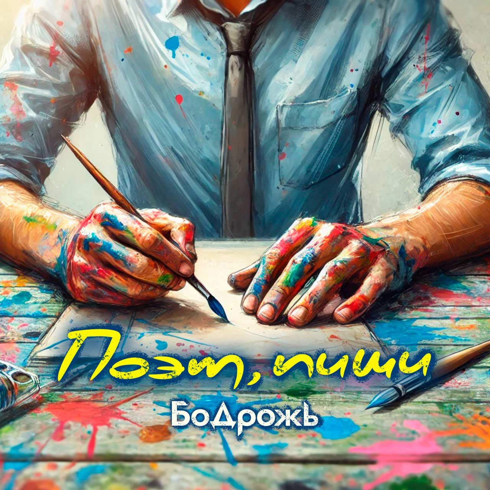

## Бодрожь - Поэт, пиши <small>(текст песни)</small>

Поэт, пиши, развивай стихию.  
Грамотно изложи, завуалируй.  
Чтоб где-нибудь в глуши души проснулась сила.  
И новые мелодии играла лира.  

Чтоб оживали образы, фантазия.  
Переливалось красками многообразие.  
Пусть радужно и радостно или до дрожи просто.  
Дождём по коже, в глаза сиянье звёзд.  

Вызови новых мыслей мириады.  
Найдётся тот, кто явно будет им.  
В воде чёрной белые блики покажи.  
Раствори чёрствость, наполни новым жизнь.  

Тайны в картины вставь,  
Сюжеты, необычные места,  
Чтоб поражали, словно поражает сталь.  

Твои творения под ветра дуновение,  
На мгновение  
Пусть остановят время.  

`***`

*Припев: (2 раза)*

Устал - перо отставь,  
Но не бросай хрусталь,  
Который разлетится, пьедестала недостав.  

Пусть уголок холста,  
Как уголёк костра,  
Позволит свет зажечь внутри, началом стать.  

`***`

Пусть картины помогают принимать решения,  
Будоражат до мурашек и в груди жжения.  
Как глоток путнику, что испытал лишения.  
И остался в состоянии изнеможения.  

Будут времена без мыслей,  
Муза играет в прятки, вы на "вы" с ней.  
Наоборот, бывает только успевай записывать  
И собирать, как бисер.  

Связывать и шифровать,  
Наделять их тайным смыслом.  

Поэт пиши, художник рисуй  
Не обессудь  
И в призме творчества  
Отрази замысел и суть.  

Если в тиши пожар, то - потуши.  
Холод согрей скорее,  
Не терпит время.  

`***`

*Припев: (2 раза)*

Устал - перо отставь,  
Но не бросай хрусталь,  
Который разлетится, пьедестала недостав.

Пусть уголок холста,  
Как уголёк костра,  
Позволит свет зажечь внутри, началом стать.

`***`

Каждый из нас художник своей судьбы,  
Каждый из нас поэт этого дня.  
Из зеркала кидает новый вызов визави.  
Ты принимай его с улыбкой и любя.  