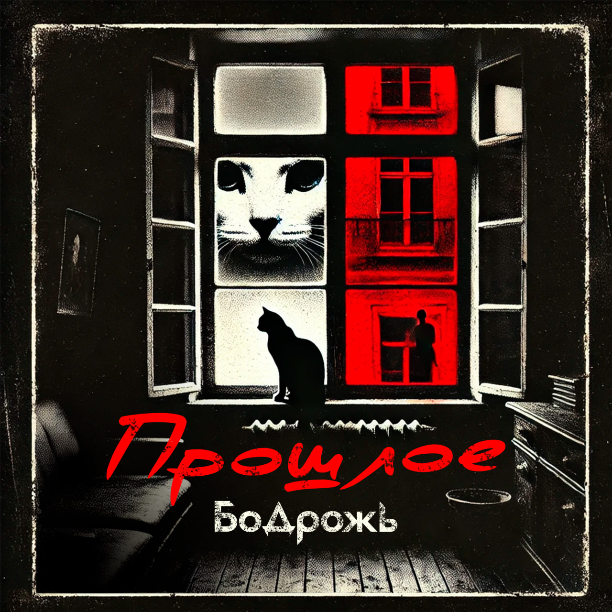

## Бодрожь - Прошлое <small>(текст песни)</small>

Прошлое...  
Приходит в белом, убегает чёрной кошкою.  
Воспоминания приносит понемножку И  
Наполнит мыслями, скрываясь за окошками.  
А уходя улыбчиво усмехнётся...

А уходя улыбчиво махнёт ладошкою,  
На подоконнике оставит только крошки им.  
Хочешь смахни, а если хочешь - скушай ложкою,  
Не наполняй только её тревогой ложною.

Проще окажется, там где виднелось сложное.  
И где нельзя на самом деле было можно, но  
Нам зачастую грань увидеть явно не дано...  
Глаза сверкали, удалялось темное пятно.

`***`

*Припев: (2 раза)*

Отрывки чувств соедини воедино,  
Из них сложи цельную картину.  
Жизнь полна красок, собери пазл.  
Создай сюжет, чтобы потом сказывали.

`***`

Глаза блестели, вместе с тем  
Там радость и печаль,  
Ярости отпечаток  
И не подобрать ключа.

Глаза блистали, и местами  
Памяти тайник,  
Но растворилось в миг  
И снова тихо, где был крик.

`***`

Но мы  
время не ценим.  
Смотрим на цены.  
Рядом мир целый.  
Он - панацея.

Солнце как цедра.  
Воздух зацепит.  
В зоне привычки  
Наше плацебо.

А настоящее...  
Какие-то секреты прячем в черном ящике,  
Кому движенье, кому состояние спящее.  
Но лучше если кровь бурлящая, мысли кипящие.  
Глаза горящие, куда тащат.

Ставим акценты.  
Главное - в центр.  
Высоко целить,  
Лучше, чем цепи.

Пусть даже в цехе  
Или на сцене.  
Сохранить душу -  
Это бесценно.

Нам зачастую грань увидеть явно не дано...  
Глаза сверкали, удалялось темное пятно.

`***`

*Припев: (2 раза)*

Отрывки чувств соедини воедино,  
Из них сложи цельную картину.  
Жизнь полна красок, собери пазл.  
Создай сюжет, чтобы потом сказывали.