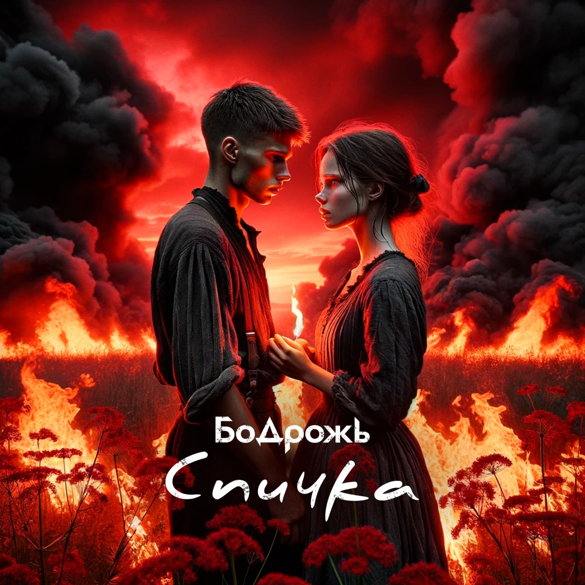

## Бодрожь - Спичка <small>(текст песни)</small>

Наденешь маску, снова расскажешь сказки.  
На сколько тебя хватит получать эмоций встряску?  
Вряд ли предашь огласке то, что делишь ласку  
С кем-то другим и притаив опаску...

Застряв на кульминации, ты ждешь развязку,  
Но не от кого получить решения подсказку.  
Может покинуть, оставив ключей связку,  
И всё забыть, залить белой замазкой...

...Или продолжить плести из неувязок.  
По новой череде обмана и отмазок,  
И мастерски обыгранных тобою песен/плясок,  
На чёрно-белую раскраску поднакинув красок.

`***`

*Припев: (2 раза)*

Горела спичка,  
Летела в поле.  
Ломалась смычка,  
Скрипя от боли.

Смеялись искры,  
Вокруг сияя.  
Стала чужая ты.  
Сама не своя.

`***`

В этом огне  
Цветы пылали.  
От них в заре  
Вы убегали.

Они стоят,  
Смотрят безмолвно.  
Поникли в ряд,  
Смирились словно.

Не уберечь их,  
А вы пытались?  
Пылали свечи,  
Наземь ссыпаясь.

Бежали быстро,  
Бежали долго.  
Плакали искры,  
Касаясь колко.

Прямо на стычку,  
Глотая горе,  
Летела спичка,  
Горело поле.

`***`

А мы бежим (с тобой)  
В огненном море.  
Жар избежим (любовь)  
Или утонем.

`***`

*Припев: (2 раза)*

Горела спичка,  
Летела в поле.  
Ломалась смычка,  
Скрипя от боли.

Смеялись искры,  
Вокруг сияя.  
Стала чужая ты.  
Сама не своя.