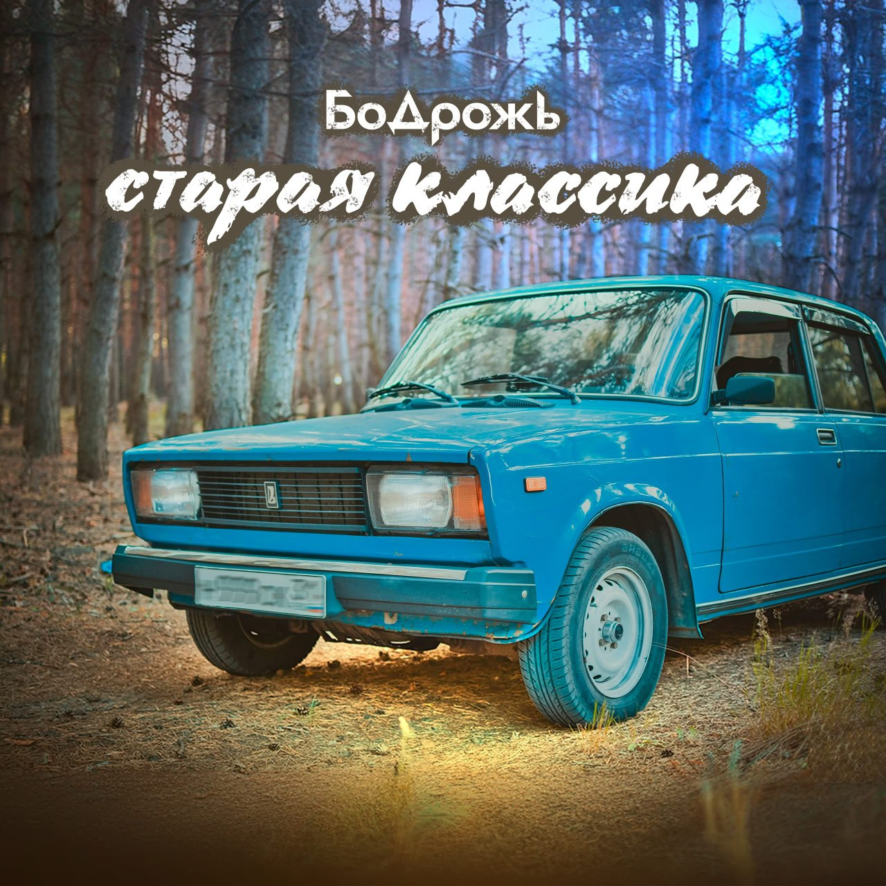

## Бодрожь - Старая классика <small>(текст песни)</small>

Старая классика  
В лесном массиве.  
Её немало помотало.  
(Помнит)

`***`

*Припев: (2 раза)*

Держась за руки, переключая вместе передачи,  
Быть может в те моменты отрывали от судьбы удачу.  
И это много значило. Быть может зря начали.  
Осталось за кадром, запечатлено.  

`***`

Старая классика  
Остановится в лесном массиве.  
Её немало поносИло по России.

Немного подустала,  
Но пока хватает сил.  
И Время потрепало,  
А не смогло скосить.

Вывозила где другие не вывозили,  
И своим ходом после брода,  
Трудности переносила.

Подустала, но пока хватает сил.  
Какой урон бы мир огромный ей не наносил.  

Видела встречи, прощания,  
Упрёки, обещания.  
И знает больше, чем многие вокруг.

Сквозь время, расстояния,  
С теплом воспоминания  
В себе хранит, как старый, верный друг.

`***`

*Припев: (2 раза)*

И снова окна настежь, наполнит воздух свежий  
Всё так же нами между пространство, атмосферу.  
Переплетаем чувства - дружба, любовь, надежда.  
В них сохраняем веру как и прежде.

`***`

Вспомним как застревали.  
Две стороны одной медали  
И что-то общее объединяет нас.  

Как путь свой продолжали  
В неведомые дАли,  
А отправлялись в новый путь мы не один раз.

Как в тех далёких местах,  
Скрыта любовь, боль и страх.  
Веками спрятана история от глаз.

С улыбкою на устах,  
Жизни страницы листать  
Мы продолжаем обрывками фраз.

Старая классика  
В лесном массиве.  
Её немало поносИло по России.

Немного подустала,  
Но хватает сил ей.  
И время потрепало.

`***`

*Припев:*

Видела встречи, прощания,  
Упрёки, обещания.  
И знает больше, чем многие вокруг.

Сквозь время, расстояния,  
С теплом воспоминания  
В себе хранит, как старый, верный друг.

Как в тех далёких местах,  
Скрыта любовь, боль и страх.  
Веками спрятана история от глаз.

С улыбкою на устах,  
Жизни страницы листать  
Мы продолжаем обрывками фраз.