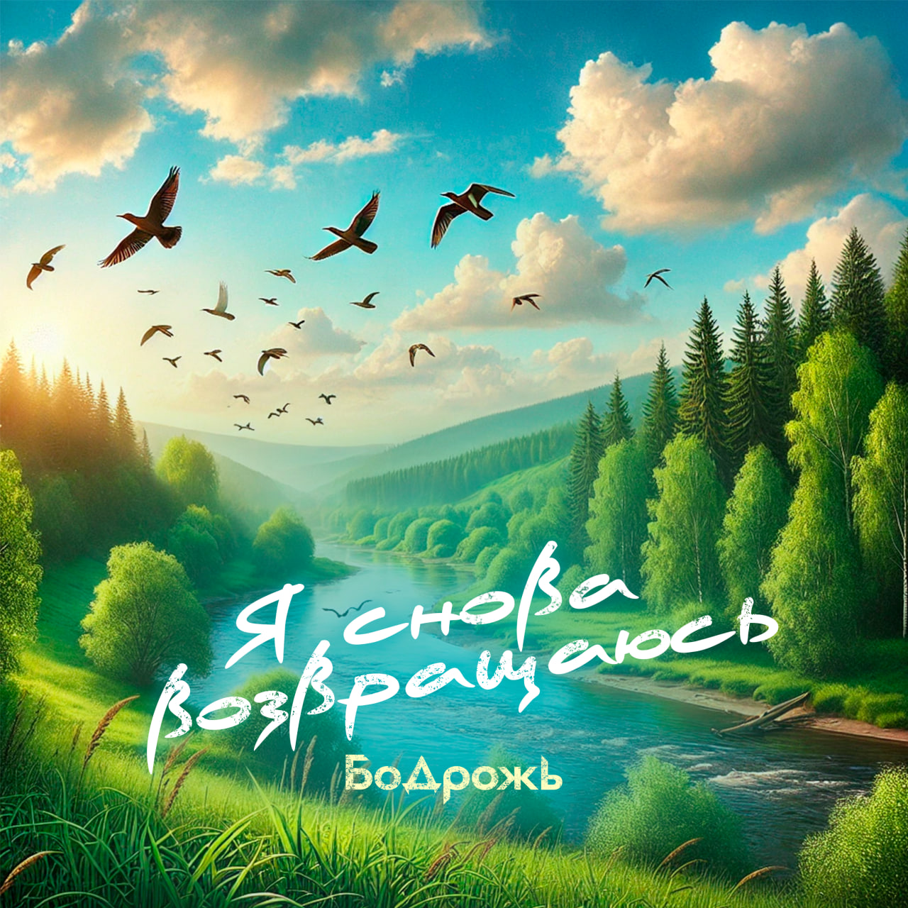

## Бодрожь - Я снова возвращаюсь <small>(текст песни)</small>

Я снова возвращаюсь в места красивые.  
Пройдусь между осин, высоких елей.  
Оставив суету, наполнюсь новой силою.  
Мне их спокойствие порой милей.

Небо здесь ясное, голубо-синее.  
Юрко плывут, играют облака.  
Чёрствость уходит в горизонт, за линию.  
Усыпана земля цветами, рядом река.

`***`

*Припев: (2 раза)*

Я закрываю глаза, лечу куда-то в даль.   
Путь легкий, как вуаль, и прошлого не жаль.  
Всё родное берегу я как хрусталь.  
Пусть будет всё, как в сказке встарь.

`***`

Душа раскрыта, как поле колосистое,  
Нальется радостью и теплотой.  
Осанку выпрямила ель сизая,  
Ей тоже нравится здешний покой.

Меня зовет к себе стезя росистая,  
Там, где травою ветер шелестит.  
Низины и возвышенности дорогу выстелют,  
Откроют в дали превосходный вид.

`***`

*Припев: (2 раза)*

Я закрываю глаза, лечу куда-то в даль.   
Путь легкий, как вуаль, и прошлого не жаль.  
Всё родное берегу я как хрусталь.  
Пусть будет всё, как в сказке встарь.

`***`

Порою хочется нам птицей в небе раствориться,  
За воздух зацепиться, покинуть шум и лица.  
Наедине остаться с мыслями, с природой слиться  
И в таком месте очнуться, очутиться - (где)

Места неописуемые виды образует.  
Художник и поэт пытаются, частично зарисуют  
Как Земля с цветами расцветает, ветер играет,  
По листьям скатываясь, капли тают.

И то, как там светает, какие запахи витают,  
Как природа оживает красками, их сочетая.  
Птиц стая клином где-то на заднем плане пролетает,  
Лед в сердце может тронуться, растаять.

Встречают пеньем птицы голосистые,  
Его так любит слушать лесной массив.  
Налиты золотом поля волнистые,  
Едва покинешь их, всю красоту не раскусив.

`***`

*Припев: (2 раза)*

Я закрываю глаза, лечу куда-то в даль.   
Путь легкий, как вуаль, и прошлого не жаль.  
Всё родное берегу я как хрусталь.  
Пусть будет всё, как в сказке встарь.

`***`