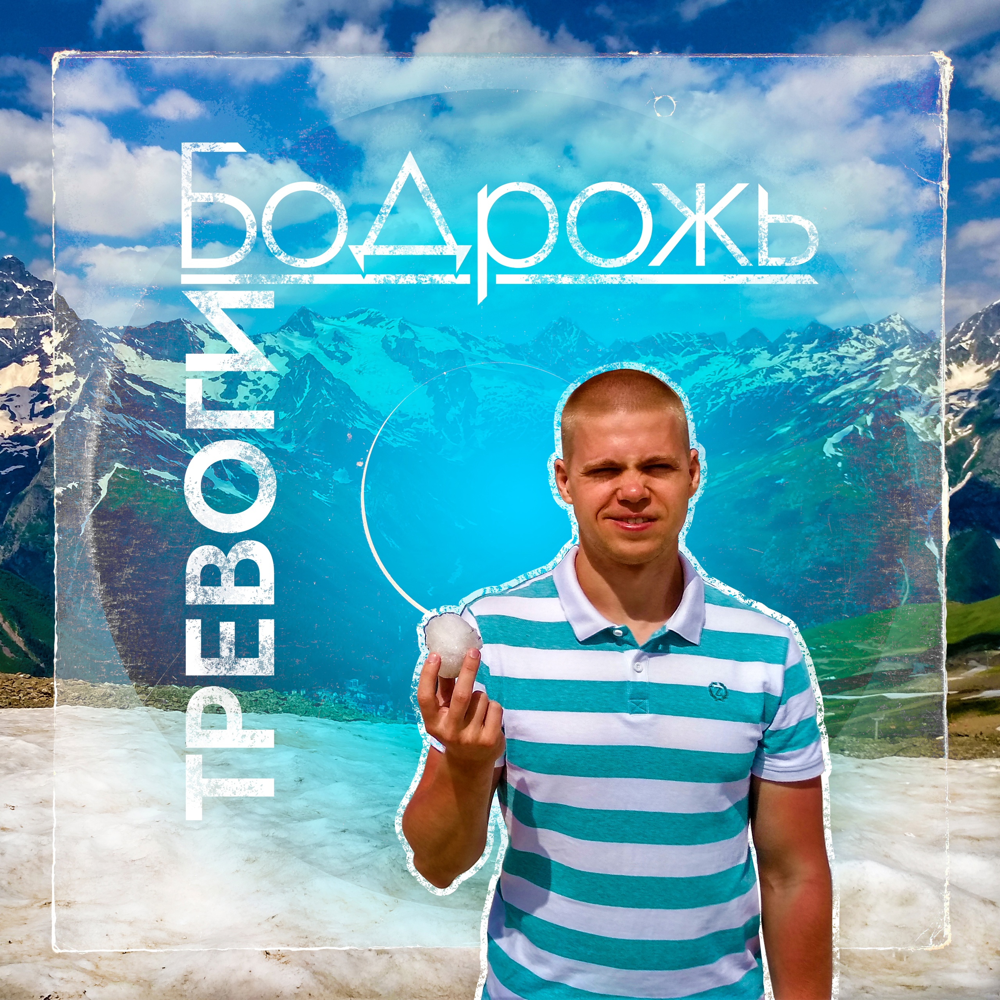

## Бодрожь - Тревоги <small>(текст песни)</small>

Время, разлука, к сожалению, не лечат.  
Воспоминания хоть и порадуют, но покалечат.  
И в мыслях часто появляется тот вечер,  
После которого мир стал мой обесцвечен.  

И сложно нам забыть, стереть на вечность  
Хотя бы те места с изъянами, оставив безупречность.  
Куда-то прячется вся легкость и беспечность,  
С которой можно вновь по ветру в бесконечность.

`***`

*Припев: (2 раза)*

Тревоги забуду, буду пропускать мимо.  
Радостные моменты надежно мной хранимы.  
Просыпаются внутри к жизни любви порывы.  
Все дороги открыты, счастье на пороге.

`***`

Впрочем, от мыслей на душе не станет легче.  
Грусть обвивает, сил упадок обеспечит.  
И без того наш век ужасно быстротечен,  
Чтобы в пустую его тратить на сердечность.

Аналогично дни делить на чёт и нечет,  
Бросаться в крайности, забыв про человечность.  
Рядом всегда где-то крадётся злая нечисть,  
Удобных случаев ждёт нанести увечье, но...

`***`

*Припев: (2 раза)*

Тревоги забуду, буду пропускать мимо.  
Радостные моменты надежно мной хранимы.  
Просыпаются внутри к жизни любви порывы.  
Все дороги открыты, счастье на пороге.